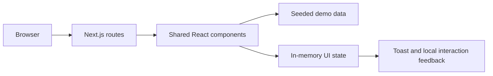
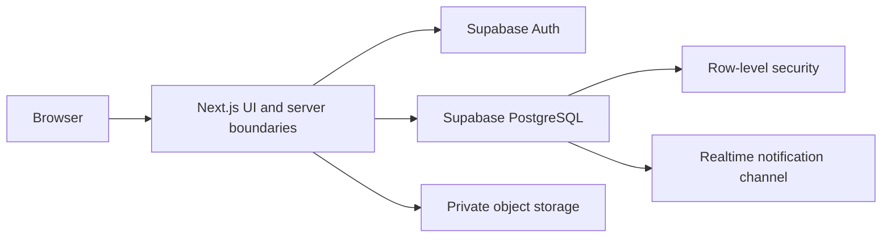

# Corneer architecture guide

This document describes the system that exists today and the boundary intended
for the next backend milestone. It does not describe Supabase as already
implemented.

## Current application

- Next.js App Router with TypeScript.
- React client components for the interactive proof-of-concept state.
- Plain CSS design system and responsive rules in `app/globals.css`.
- Fictional marketplace records in `lib/data.ts`.
- Shared marketplace and workspace components in `components/`.
- Server metadata in `lib/seo.ts`, public sitemap and robots routes, and shared
  self-hosted brand assets. Workspace layouts apply noindex metadata.
- Static generation for fictional supplier and RFQ detail routes, with dynamic
  buyer detail support for temporary order previews. Query-aware request,
  directory, and messaging routes use server page props.

## Current data flow



There is no server database, real account, private file store, or durable
message history. Refreshing the page returns the demonstration to its seeded
state.

`DemoProvider` also owns temporary order briefs, supplier responses, shortlists
and identity recipients keyed by request, and messages/meeting proposals keyed
by request and supplier. `lib/sourcing.ts` compares explicit fictional profile
fields. It neither scores supplier reliability nor verifies capabilities.

Temporary `demo-<uuid>` request links expire on reload and display a recovery
action. New briefs are previews and never enter the supplier opportunity feed.
Supplier demo responses update the matching buyer comparison in the same
session. Conversation lists are derived from explicit identity recipients;
there are no pre-opened threads implying that the buyer already shared identity.

## Folder ownership

| Location      | Responsibility                                                    |
| ------------- | ----------------------------------------------------------------- |
| `app/`        | Route composition, metadata, loading state, and global styling    |
| `components/` | Reusable views and interactive product flows                      |
| `lib/data.ts` | Fictional companies, products, RFQs, responses, and conversations |
| `docs/`       | Architecture, scope, frontend behavior, and acceptance records    |
| `public/`     | Reserved for future first-party static assets                     |

The large stylesheet is intentional for the POC: it exposes the full visual
language in one place. Split it only when ongoing feature work creates clear,
stable ownership boundaries.

## Product boundaries represented in code

The company is the primary marketplace object. Product cards are discovery
examples that link back to a supplier profile; they are not commerce SKUs.

The principal flow is:

```text
verified buyer summary
  -> private RFQ
  -> eligible supplier response
  -> buyer comparison and shortlist
  -> deliberate identity reveal
  -> conversation and meeting
```

The direct-discovery flow is:

```text
supplier or product search
  -> company profile
  -> inquiry or RFQ invitation
```

## Trust model

The interface distinguishes three kinds of statements:

- **Checked:** Corneer reviewed a specific identity or registration fact.
- **Reviewed:** Corneer reviewed submitted evidence without guaranteeing the
  underlying operating capability.
- **Reported:** the company supplied the claim and Corneer did not verify it.

The product must never reduce these distinctions to a blanket guarantee.

## Future backend seam

The intended next architecture keeps the same user journeys while replacing
demo state behind a clear boundary:



Before implementing that milestone, define and review:

- Organizations and organization memberships.
- Buyer and supplier permissions.
- RFQ anonymity and reveal rules.
- Verification checks, evidence access, and audit history.
- Conversation participant policies.
- Private upload constraints and retention.

SQL migrations should become the schema source of truth. Service credentials
must remain server-only, and database row-level security must enforce the same
boundaries shown by the UI.

## Deliberate omissions

- No payments, escrow, shipping, logistics, or customs workflow.
- No subscription or billing implementation.
- No automated or AI supplier matching.
- No public contact-detail scraping.
- No claim that Corneer guarantees a transaction outcome.
