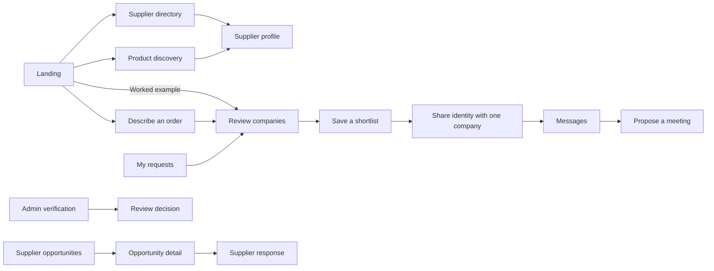

# Corneer frontend guide

This is the developer and reviewer map for the frontend proof of concept.

## Product surface



## Route map

| Route                          | View                             | Primary implementation                  |
| ------------------------------ | -------------------------------- | --------------------------------------- |
| `/`                            | Public landing                   | `app/page.tsx`                          |
| `/suppliers`                   | Searchable supplier directory    | `components/suppliers-explorer.tsx`     |
| `/suppliers/[id]`              | Company profile and verification | `app/suppliers/[id]/page.tsx`           |
| `/products`                    | Product showcases                | `app/products/page.tsx`                 |
| `/buyer/rfqs`                  | Buyer workspace                  | `app/buyer/rfqs/page.tsx`               |
| `/buyer/rfqs/new`              | Three-step order brief           | `components/rfq-form.tsx`               |
| `/buyer/rfqs/[id]`             | Company comparison and sharing   | `components/buyer-request-detail.tsx`   |
| `/supplier/opportunities`      | Supplier opportunity feed        | `app/supplier/opportunities/page.tsx`   |
| `/supplier/opportunities/[id]` | RFQ brief and response form      | `components/supplier-response-form.tsx` |
| `/messages`                    | Conversation workspace           | `components/message-center.tsx`         |
| `/admin/verification`          | Verification operations          | `components/admin-verification.tsx`     |

## Demo state

`components/demo-provider.tsx` owns the small amount of cross-route concept
state:

- Selected demonstration role.
- Temporary order previews and supplier responses.
- Buyer identity recipients and shortlisted supplier IDs per request.
- Messages and meeting proposals per request/supplier conversation.
- Toast feedback.
- Selected English or Bahasa Indonesia language, saved in browser storage.

Form fields stay local while moving between steps, then enter the provider
when a preview is created. No marketplace interaction is durable. Language
preference is the only persisted setting. The role switcher lives in the quiet
demo bar and is not real authorization.

## Demo language

`lib/i18n.ts` is the single English-to-Indonesian copy dictionary. The header
shows Bahasa Indonesia (`id`) first and English (`en`) second. Fresh visitors
start in Bahasa Indonesia; a saved choice still takes precedence on every route.
`DemoProvider` applies the selected language to visible interface copy,
accessibility labels, placeholders, and untouched prefilled demo fields. The
supplier search accepts terms from either language. Company names, document
filenames, technical standards, and user-entered text stay as written.

This is a frontend demo language layer. Before using real marketplace content,
replace its DOM copy adapter with explicit localized fields and route-aware
rendering. The initial HTML and metadata remain English, so Bahasa is applied
after hydration rather than being server-rendered.

## Data fixtures

`lib/data.ts` contains the typed fictional fixtures used by every surface:

- `suppliers`
- `products`
- `rfqs`
- `rfqResponses`
- `conversations`
- `verificationQueue`

Keep fixtures obviously fictional. Do not copy real company catalogs,
certificates, contact information, or personal data without permission.

## Visual system

The shared visual language is defined in `app/globals.css`:

- Deep green trust surfaces.
- Lime primary actions and live-state accents.
- Neutral paper backgrounds.
- Readable B2B information density: 13–16px for regular copy and a 12px
  minimum for compact metadata, badges, and overlines.
- Shared page width and gutters use `--content-max` and `--page-gutter`.
  Avoid stacking another large horizontal gutter on page-level wrappers.
- Responsive breakpoints at 1,100, 1,000, 900, and 720 pixels.
- On phones, supplier filters open from the Filters button; messaging and admin
  verification provide back buttons to reach their hidden lists. Layouts are
  checked at 320px and 390px phone widths and 768px tablet width.

Remote Unsplash images are used for this POC. Production should use licensed,
first-party supplier media with an explicit storage and moderation policy.

## Interaction contracts

### Buyer identity reveal

The buyer remains represented by a checked business summary until the buyer
explicitly reveals its company to a shortlisted supplier. A production API
must enforce this rule; hiding text in the browser is insufficient.

The share control names the recipient and previews the fictional company
profile/website being shared. Recipients are scoped to a request. Removing a
company from the shortlist does not undo an earlier identity share. Messages
only list companies with an explicit share; drafts, messages, and proposals
remain separate across threads.

### Buyer entry and order preview

The homepage has one primary CTA, **Describe your order**, a secondary company
directory link, and a worked example. The order form validates required title,
quantity, styles and colors; production details are optional and explained in
context. Its review step uses the entered values and creates a company preview
rather than pretending to distribute an RFQ. The buyer dashboard derives its
counts from session state.

`components/buyer-request-detail.tsx` resolves seeded and temporary briefs.
`lib/sourcing.ts` compares category, profile-listed capabilities, and estimated
units per style/color. New previews show no invented quotes or production
availability. Missing listings remain unconfirmed; existing fictional replies
include concrete tradeoffs and suggested questions. Supplier selection is not
ranked by an unexplained percentage.

Directory text, category, company type, location, registration-check, minimum
order, and capability filters operate on fixture data. Sorting uses company
name, minimum order, or operating years. Profile contact links carry the chosen
supplier into the order form.

### Supplier response

The supplier response combines a company statement, indicative range, lead
time, minimum order, and optional sampling time. A submitted demo response
updates the buyer comparison in the same session. Profile and verification
context accompany the response automatically; submitted claims are not checked.

### Verification review

Administrative decisions record individual checked items. The interface does
not present one approval as a guarantee of future product, delivery, or
commercial performance.

## Browser acceptance checks

Test at minimum:

1. Public supplier search filters visible fixture data.
2. Every supplier and product card opens a valid company profile.
3. The order form blocks empty required fields, retains edits between steps,
   and creates a preview containing the entered brief. Its dashboard row exists
   during the session; reloading the temporary link explains expiration.
4. Buyer response comparison can add or remove a shortlist.
5. Identity sharing names one saved company, exposes its conversation CTA,
   and leaves other recipients/requests private.
6. A supplier response can be submitted and returns a success state.
7. Demo messages, drafts, and meeting proposals remain scoped to their thread.
   Meetings remain proposed and do not imply acceptance or a calendar invite.
8. Admin approval and information-request actions show recorded feedback.
9. Public, buyer, supplier, and admin navigation labels match the selected view.
10. Every route remains usable without page-level horizontal scrolling at
    320px and 390px widths; the homepage also fits at 768px.
11. No visible interface copy renders below 12px at desktop or mobile widths.
12. Dense workspaces use the available desktop width without horizontal overflow.
13. Fresh visitors start in Bahasa with ID on the left of EN. The switch
    changes all demo routes, survives reloads, and can switch back to English
    without changing filters or user-entered text.
14. Indonesian terms work in supplier search; technical standards and company
    names retain their original form.
15. On mobile, the supplier filters, conversation list, and verification queue
    can be opened, used, and exited without losing their selected item.

## Development workflow

Page titles, canonical URLs, search indexing, social thumbnails, and generated
logo assets are documented in `docs/04-seo-and-brand.md`. Client-only pages use
server layouts for metadata; temporary preview and conversation titles reflect
the selected session data.

`npm run dev` serves the local demo at <http://localhost:3101>.
The public review build is at <https://corneer.vercel.app/> and deploys from the
GitHub `main` branch. It remains a frontend-only demonstration.

```powershell
npm run format
npm run check
```

When product behavior changes, update this guide, the relevant scope document,
and the milestone acceptance checklist in the same change.
