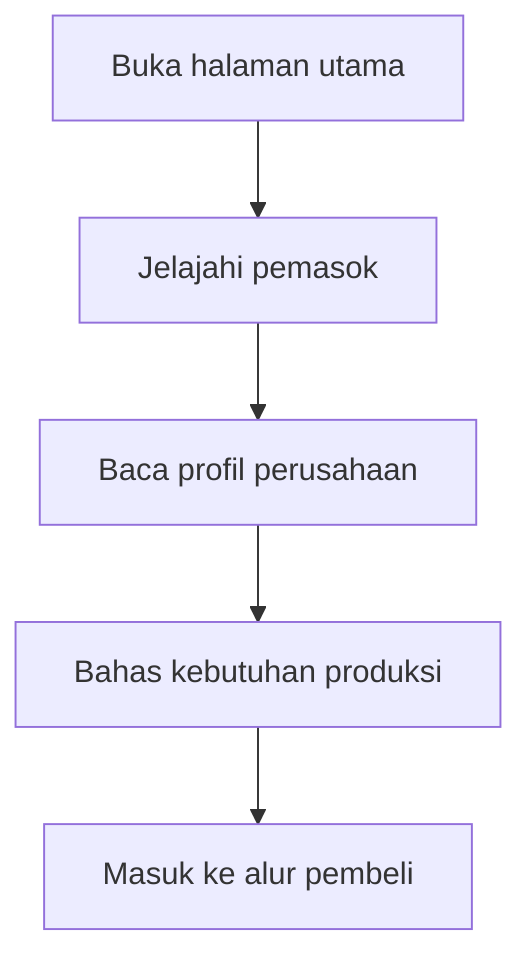
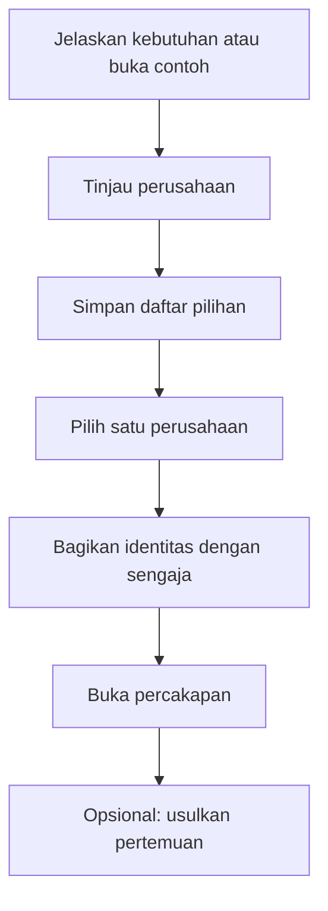
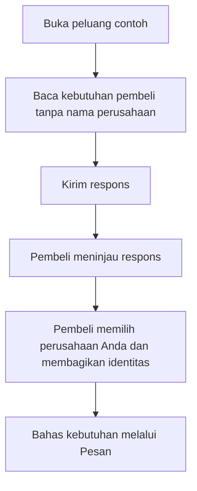

# Cara menggunakan Corneer

[Read in English](../english/user-journey.md)

Corneer membantu bisnis menemukan pemasok pakaian dan memulai percakapan
tentang kebutuhan produksinya.

| Peran      | Pertanyaan utama                                            |
| ---------- | ----------------------------------------------------------- |
| Pengunjung | Perusahaan apa saja yang tersedia?                          |
| Pembeli    | Perusahaan mana yang sebaiknya saya hubungi?                |
| Pemasok    | Apakah perusahaan saya bisa memenuhi kebutuhan pembeli ini? |

Buka [demo Corneer](https://corneer.vercel.app/). Gunakan **Tampilan demo** di
bagian atas untuk berganti peran. Pilih **ID** untuk Bahasa Indonesia atau
**EN** untuk bahasa Inggris. Pergantian ini hanya simulasi; belum ada akun
atau proses masuk yang sebenarnya.

## Pengunjung: kenali perusahaan yang tersedia

1. Buka halaman utama dan baca tiga langkah pencarian pemasok.
2. Pilih **Jelajahi pemasok**. Cari atau saring perusahaan yang tersedia.
3. Buka profil perusahaan. Lihat produk yang dapat dibuat, jumlah pesanan
   minimum, dan buktinya. Perhatikan apakah jenisnya **Produsen** atau
   **Perusahaan dagang**.
4. Pilih **Bahas kebutuhan produksi** di profil tersebut untuk masuk ke alur
   pembeli dengan perusahaan itu sudah dipilih. Anda juga bisa mulai melalui
   **Jelaskan kebutuhan Anda** di halaman utama, atau **Coba contoh alurnya**.

Contoh produk menunjukkan apa yang mungkin bisa dibuat oleh sebuah perusahaan
dan mengarah ke profilnya. Perusahaan itulah yang sedang Anda pertimbangkan.

Saat membaca profil, bedakan ketiga label berikut:

- **Dicek:** data registrasi atau identitas telah dicocokkan.
- **Ditinjau:** bukti pendukung, seperti foto atau video pabrik, telah diperiksa.
- **Dilaporkan perusahaan:** informasi berasal dari perusahaan; konfirmasikan
  langsung kepada mereka.

Semua bukti dalam demo ini fiktif. Label tersebut tidak menjamin mutu,
pengiriman, pembayaran, atau hasil transaksi.

## Pembeli: pilih perusahaan yang ingin dihubungi

1. Pilih **Jelaskan kebutuhan Anda**. Isi judul, kategori, jumlah total unit,
   jumlah model, dan jumlah warna per model.
2. Tambahkan detail produksi yang sudah diketahui, seperti bahan dan target
   pengiriman. Tinjau isian, lalu pilih **Tinjau perusahaan**.
3. Bandingkan kemampuan perusahaan, pesanan minimum, dan buktinya. Permintaan
   contoh juga menampilkan respons pemasok. Pratinjau baru belum memiliki
   penawaran harga.
4. Pilih **Simpan ke daftar pilihan** untuk perusahaan yang menarik.
5. Pilih **Pilih siapa yang dihubungi**, pilih satu perusahaan yang disimpan,
   periksa nama penerimanya, lalu pilih **Bagikan identitas kepada perusahaan ini**.
6. Pilih **Buka percakapan**. Bahas kebutuhan produksi atau **Usulkan pertemuan**.
   Gunakan **Permintaan saya** untuk kembali ke kebutuhan dan contoh permintaan.

**Menyimpan perusahaan tidak membuka identitas Anda. Membagikan identitas
adalah tindakan terpisah, untuk satu perusahaan dan satu permintaan.** Menghapus
perusahaan dari daftar pilihan tidak membatalkan pembagian identitas sebelumnya.

Contohnya, 800 unit untuk dua model dan dua warna berarti perkiraan 200 unit
per kombinasi model dan warna. Tanyakan bagaimana pemasok menerapkan pesanan
minimumnya.

**Kondisi demo saat ini:** kebutuhan baru menghasilkan pratinjau perusahaan
yang bersifat pribadi. Kebutuhan tersebut tidak dikirim ke pemasok dan tidak
muncul di daftar peluang mereka. Gunakan permintaan contoh yang sudah tersedia
untuk mencoba alur respons pemasok dan tinjauan pembeli secara terhubung.

## Pemasok: jelaskan bantuan yang bisa diberikan

Demo pemasok mewakili **Pearl River Performance Wear**.

1. Ganti **Tampilan demo** menjadi **pemasok**, lalu buka **Peluang**.
2. Buka permintaan contoh. Baca jumlah unit, bahan, kemampuan yang dibutuhkan,
   dan target pengiriman. Identitas perusahaan pembeli masih disembunyikan.
3. Isi alasan perusahaan Anda sesuai, kisaran harga sementara, waktu produksi,
   pesanan minimum, dan waktu pembuatan sampel jika diketahui. Pilih **Kirim respons**.
4. Respons muncul di perbandingan pembeli selama sesi demo yang sama. Pembeli
   menentukan apakah ingin menyimpan dan menghubungi perusahaan Anda.
5. Setelah pembeli secara khusus membagikan identitas kepada Pearl River,
   buka **Pesan** untuk membahas kebutuhan dan mengusulkan pertemuan.

**Mengirim respons tidak membuka identitas pembeli.** Keputusan tersebut
tetap berada di tangan pembeli.

## Coba seluruh alur demo dalam satu tab

Gunakan tab yang sama dan jangan memuat ulang halaman di antara langkah berikut.

1. Sebagai **Pengunjung**, pilih **Coba contoh alurnya** di halaman utama.
   Anda akan masuk ke tampilan pembeli untuk **Koleksi lari berbahan daur ulang — SS27**.
2. Simpan **Pearl River Performance Wear** ke daftar pilihan. Pilih
   **Pilih siapa yang dihubungi**, lalu bagikan identitas pembeli fiktif kepadanya.
3. Pilih **Buka percakapan**. Tulis pesan atau usulkan pertemuan.
4. Ganti peran menjadi **pemasok**, lalu buka **Pesan**. Percakapan kini
   menampilkan perusahaan pembeli fiktif, **Northline Athletics ApS**.
5. Sebagai pemasok, buka **Peluang**, pilih permintaan pakaian lari yang sama,
   dan ubah responsnya. Pilih **Kirim respons** untuk menyimpan perubahan demo.
6. Ganti peran menjadi **pembeli**, buka **Permintaan saya**, lalu buka
   permintaan yang sama. Cari respons Pearl River yang sudah diperbarui.

## Beberapa istilah sederhana

- **RFQ:** permintaan penawaran; penjelasan tentang produk yang ingin dibuat pembeli.
- **Daftar pilihan / shortlist:** perusahaan yang disimpan pembeli untuk dipertimbangkan.
- **MOQ / pesanan minimum:** jumlah terkecil yang menurut pemasok dapat dipesan.
- **Lead time / waktu produksi:** perkiraan waktu yang dibutuhkan untuk produksi.

## Yang dilakukan demo ini

Corneer saat ini hanya berupa frontend. Semua perusahaan, permintaan, dan
identitas bersifat fiktif. Kebutuhan, respons, pesan, dan usulan pertemuan hanya
tersimpan dalam sesi browser saat ini dan kembali ke kondisi awal saat halaman
dimuat ulang. Hanya pilihan bahasa yang disimpan.

Tidak ada informasi yang dikirim ke perusahaan nyata. Usulan pertemuan belum
dikonfirmasi dan tidak mengirim undangan kalender. Pendaftaran, pemeriksaan
perusahaan, penyimpanan data, dan transaksi bisnis yang sebenarnya belum diterapkan.
