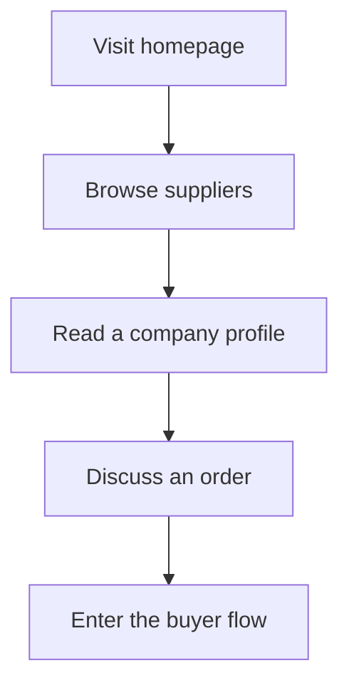
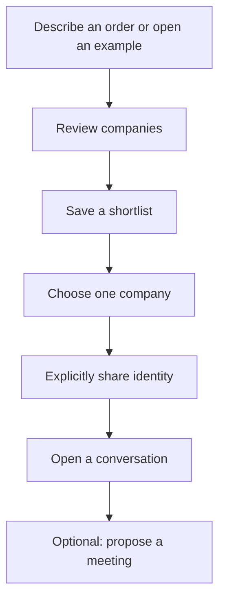
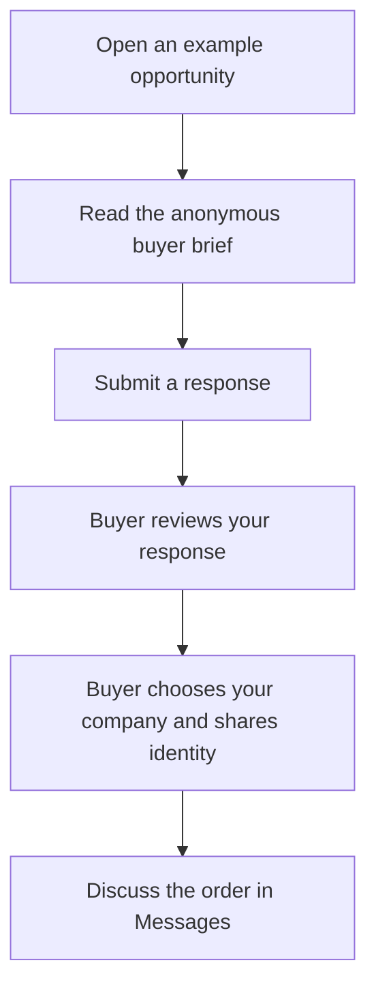

# How to use Corneer

[Baca dalam Bahasa Indonesia](../bahasa/user-journey.md)

Corneer helps a business find an apparel supplier and start a conversation
about making its products.

| Role     | Main question                                  |
| -------- | ---------------------------------------------- |
| Visitor  | What companies are available?                  |
| Buyer    | Which company should I contact about my order? |
| Supplier | Can my company support this buyer's order?     |

Open the [live demo](https://corneer.vercel.app/). Use **Demo view** at the top
to switch roles. Choose **EN** for English or **ID** for Bahasa Indonesia.
This switch simulates roles; there are no real accounts or sign-in yet.

## Visitor: explore the companies

1. Open the homepage and read the three sourcing steps.
2. Select **Browse suppliers**. Search or filter the companies.
3. Open a company profile. Look at what it makes, its minimum order, and its
   evidence. Check whether it is a **Manufacturer** or **Trading company**.
4. Select **Discuss an order** on that profile to start the buyer flow with
   that company selected. You can also start from **Describe your order**
   on the homepage, or use **Walk through an example**.

Product examples show what a company might make and link to its profile.
The company is the main thing you are choosing.

When reading a profile, keep these labels separate:

- **Checked:** registration or identity records were compared.
- **Reviewed:** supporting evidence, such as factory media, was inspected.
- **Company-reported:** the company supplied the claim; confirm it with them.

All evidence in this demo is fictional. These labels do not guarantee quality,
delivery, payment, or transaction outcomes.

## Buyer: choose who to contact

1. Select **Describe your order**. Enter a title, category, total units,
   number of styles, and colors per style.
2. Add production details you know, such as materials and delivery timing.
   Review your entries, then select **Review companies**.
3. Compare the companies' capabilities, minimum orders, and evidence.
   Example requests also show supplier responses. New previews show no quotes.
4. Select **Save to shortlist** for companies that interest you.
5. Select **Choose who to contact**, choose one saved company, check the named
   recipient, then select **Share identity with this company**.
6. Select **Open conversation**. Discuss the order or **Propose a meeting**.
   Use **My requests** to return to your orders and examples.

**Saving a company keeps your identity private. Sharing identity is a separate
action, for one company and one request.** Removing a company from the shortlist
does not undo an earlier identity share.

For example, 800 units across two styles and two colors means an estimated
200 units per style and color. Ask the supplier how its minimum order applies.

**Current demo detail:** a new order creates a private company preview. It is
not sent to suppliers and does not appear in their opportunity feed. Use an
existing example request to try a supplier response and buyer review together.

## Supplier: explain how you can help

The supplier demo represents **Pearl River Performance Wear**.

1. Switch **Demo view** to **Supplier**, then open **Opportunities**.
2. Open an example request. Read the quantity, materials, capabilities, and
   delivery requirements. The buyer's company identity is hidden.
3. Enter why your company fits, an indicative price range, production lead
   time, minimum order, and optional sampling time. Select **Submit response**.
4. The response appears in the buyer comparison during the same demo session.
   The buyer decides whether to shortlist and contact your company.
5. Once the buyer explicitly shares identity with Pearl River, open **Messages**
   to discuss the order and propose a meeting.

**Submitting a response does not reveal the buyer's identity.** The buyer
controls that decision.

## Try the complete demo in one browser tab

Keep the same tab open and do not reload between these steps.

1. As **Visitor**, select **Walk through an example** on the homepage. This
   opens the buyer view of **Recycled running collection — SS27**.
2. Save **Pearl River Performance Wear** to your shortlist. Select
   **Choose who to contact** and share the fictional buyer identity with it.
3. Select **Open conversation**. Write a message, or propose a meeting.
4. Switch to **Supplier → Messages**. The conversation now shows the fictional
   buyer company, **Northline Athletics ApS**.
5. As Supplier, open **Opportunities**, select the same running request, and
   edit its response. Select **Submit response** to save the demo change.
6. Switch to **Buyer → My requests** and open that request again. Find the
   updated Pearl River response in the comparison.

## A few useful words

- **RFQ:** request for quotation; a brief describing what the buyer wants made.
- **Shortlist:** companies the buyer has saved for closer consideration.
- **MOQ / minimum order:** the smallest quantity a supplier says it accepts.
- **Lead time:** the estimated time needed for production.

## What this demo does

Corneer is currently frontend-only. Companies, requests, and identities are
fictional. Orders, responses, messages, and meeting proposals stay in the
current browser session and reset on reload; only the language choice is saved.

Nothing is sent to real companies. Meeting proposals are unconfirmed and do
not send calendar invitations. Real onboarding, verification, persistent data,
and business transactions are not implemented.
